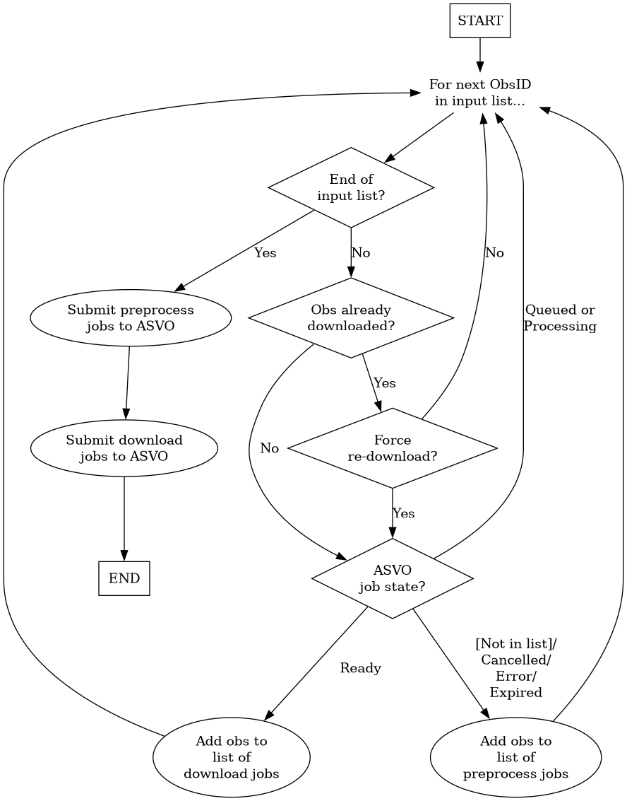

# giant-squid pipeline

## Usage

The interface for firing off `giant-squid` jobs to ASVO is called `obs_giantsquid.sh`.
This script is responsible for figuring out which of the requested ObsIDs need to yet be preprocessed, are currently being processed, or are ready to be downloaded.

The basic usage is:
```
obs_giantsquid.sh -p <epoch> -o <file_containing_obsids>
```

The full usage is:
```
obs_giantsquid.sh [-d depend] [-t] obsid [obsid ...]
  -d depend         : job number for dependency (afterok)
  -t                : test. Don't submit job, just make the batch file
                      and then return the submission command
  -f                : Force re-download (default is to ignore obsids
                      if the measurement set already exists).
  -o obsid_file     : the path to a file containing obsid(s) to process
```

The script is designed to be "safe" to rerun multiple times on the same set of ObsIDs.
Indeed, it *must* be run at least twice per ObsID: once to request the conversion job, and once to request the download job some time later.
(For HPC systems, [it is recommended that SLURM jobs do not "wait" for conversion jobs to be complete](https://mwatelescope.atlassian.net/wiki/spaces/MP/pages/65405030/MWA+ASVO+Use+with+HPC+Systems).)

## Flowchart

The flowchart for downloading observations is as follows.



## Tips

Lists of ObsIDs can be obtained by querying the GPM database.
For example, the following can be used to obtain a list of all ObsIDs in a given epoch:
```
gpm_track.py epoch_obs --epoch Epoch0032 > Epoch0032.txt
```
