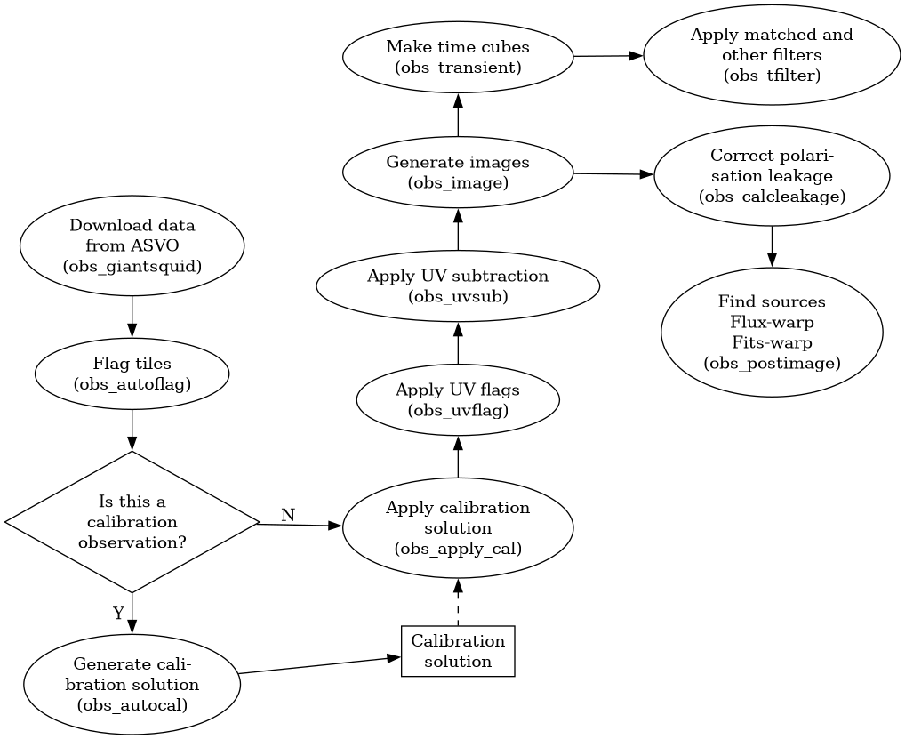

# Processing pipeline

The processing pipeline for the GPM is very similar to (because it is based on) GLEAM-X, which can be found [here](https://github.com/GLEAM-X/GLEAM-X-pipeline).
**This** documentation, however, strives to be self-contained.

- [Overview](#overview)
- [Running the pipeline](#running-the-pipeline)
  - [Running individual steps](#running-individual-steps)
  - [Running steps in sequence with dependencies](#running-steps-in-sequence-with-dependencies)
  - [Running whole dependency chains all at once](#running-whole-dependency-chains-all-at-once)

## Overview

The GPM processing pipeline is essentially an *imaging* pipeline for radio astronomical data, with a few extra steps tacked onto the end designed to look specifically for transients within the generated images.
The various steps are illustrated in the following diagram:



## Running the pipeline

### Running individual steps

Each of the oval-shaped nodes in the [overview diagram](#overview) above can be run as an individual step by running the corresponding script named in the brackets, which are found in the [bin](https://github.com/robotopia/MWA-Galactic-Plane-Monitoring/tree/main/bin) folder (note that the actual file names end in `.sh`).
For example, to run the "Download data from ASVO" step, you can simply run (once your profile has been loaded):
```
obs_manta.sh ...
```
where the `...` represents whatever arguments that script requires.
You can find the usage information for each script by running that script with `-h`, e.g. running `obs_manta.sh -h` generates the following output:
```
gpm_pipe.sh [-d depend] [-s timeres] [-k freqres] [-e edgeflag] [-t] obsid_or_file
  -d depend         : job number for dependency (afterok)
  -s timeres        : time resolution in sec. default = 2 s
  -k freqres        : freq resolution in KHz. default = 40 kHz
  -e edgeflag       : number of edge band channels flagged. default = 80
  -g                : download gpubox fits files instead of measurement sets
  -t                : test. Don't submit job, just make the batch file
                      and then return the submission command
  -f                : Force re-download (default is to quit with exit code 2
                      if the measurement set already exists).
  obsid_or_file     : the obsid to process OR a file containing obsids
```

### Running steps in sequence with dependencies

All of the individual scripts include a `-d` option, which can be used to set up dependency chains between individual steps.
This is useful because typically when a job is run on a supercomputer, it is not run immediately, but rather added to a queue, and only gets run once resources become available.
Instead of waiting for each step to finish running before starting the next step in the sequence, you can use the `-d` option to specify that this step should only be run after the successful completion of some other step (presumably, the previous step in the sequence).
You specify which step must be completed first by giving its (SLURM job) ID number as the argument to `-d`.

For example, if you first run `obs_manta.sh ...`, and then look at the SLURM queue (`squeue`), you will find that my `obs_manta` job has been assigned a job ID, say `654321`.
Then, even though the `obs_manta` job hasn't finished yet (in fact, it may not even have started yet!) you could immediately run `obs_autoflag -d 654321 ...`, and rest assured that it won't start until the `obs_manta` job has successfully completed.

### Running whole dependency chains all at once

Instead of running the steps individually as above, a wrapper script has been provided that allows you to run whole dependency chains automatically: the `gpm_pipe.sh` script (also in the [bin](https://github.com/robotopia/MWA-Galactic-Plane-Monitoring/tree/main/bin) folder).
As with the `obs_...` scripts, `gpm_pipe.sh -h` can be used to show this script's usage, reproduced here for convenience:
```
gpm_pipe [options] [-h] commands obsid [obsid ...]
  options     : Options passed to the listed commands. The command-specific options are:

                Command    | Option       | Description
                -----------+--------------+--------------------------------------
                [some/all] | -f           | Force. Whatever that means for each command, do it.
                           |              | (Currently only for "manta")
                           | -t           | Test. Whatever that means for each command, do it.
                           | -z           | Debugging mode. Whatever that means for each command,
                           |              | do it.
                           | -v           | Verbose mode
                manta      | -s timeres   | time resolution in sec. default = 2 s
                           | -k freqres   | freq resolution in KHz. default = 40 kHz
                           | -e edgeflag  | number of edge band channels flagged. default = 80
                           | -g           | download gpubox fits files instead of measurement sets
                autocal    | -i           | Disable the ionospheric tests (default = False)
                           | -F frac      | the acceptable fraction of spectrum that may be flagged
                           |              | in a calibration solution file before it is marked as
                           |              | bad. Value between 0 - 1. (default = 0.25)
                           | -S sfrac     | the acceptable fraction of a segmented spectrum that may
                           |              | be flagged in a calibration solution file before it is
                           |              | flagged as bad. Typical GLEAM-X processing has four
                           |              | sub-bands, so there are four segments. If a single
                           |              | segment has more then SFRAC flagged it is marked as bad.
                           |              | (default = 0.4)

  commands    : A string of space-delimited commands to run, as a dependency chain, in the order in which they are listed.
                e.g. "image postimage" will run "obs_image.sh" followed by "obs_postimage.sh". Available commands:
                    apply_cal, autocal, autoflag, calcleakage, image, postimage,
                    tfilter, transient, uvflag

  obsid       : The obsid(s) of the observation(s) to be processed

  EXAMPLE:

      gpm_pipe.sh "autoflag apply_cal uvflag image transient postimage tfilter" OBSID1 OBSID2 ...
```
