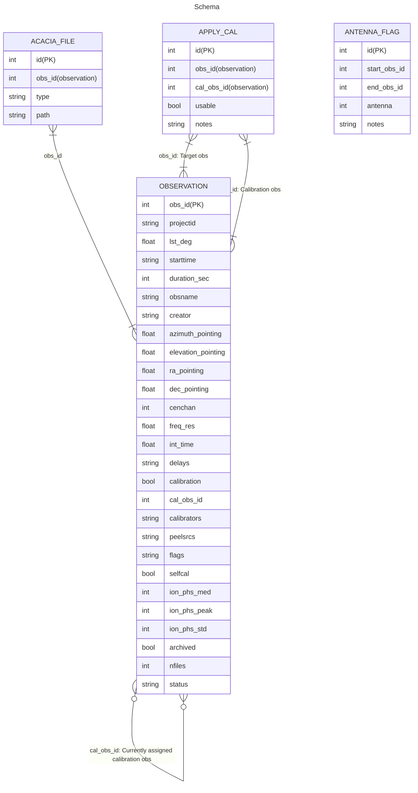

# Schema for the GPM processing database

## Overview diagram

## Tables

| Table | Type | Description |
| :---- | :--- | :---------- |
| `acacia_file`  | Base | The locations of data products that have been uploaded to Acacia |
| `antennaflag`  | Base | Tiles that have been flagged as unusable over a specified time period |
| `apply_cal`    | Base | Calibration solutions that can/can't be applied to specific observations |
| `assigned_cal` | View | Same as `apply_cal`, but shows the epoch instead of the id |
| `calapparent`  | Base | [Deprecated] |
| `epoch`        | View | For each observation, which "epoch" it belongs to. |
| `mosaic`       | Base | Generated mosaics (not currently used) |
| `observation`  | Base | The metadata for MWA observations |
| `processing`   | Base | Processing jobs run on the supercomputer |
| `sources`      | Base | Source models for calibration (currently not used) |
