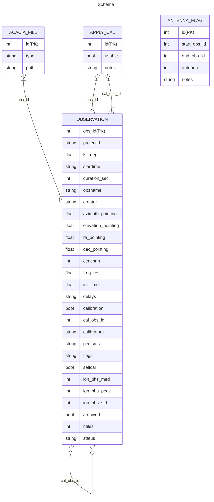

# Schema for the GPM processing database

```mermaid
---
title: Schema
---
erDiagram
    OBSERVATION }o--o{ OBSERVATION : cal_obs_id
    ACACIA_FILE }|--|{ OBSERVATION : obs_id
    APPLY_CAL }|--|{ OBSERVATION : obs_id
    APPLY_CAL }|--|{ OBSERVATION : cal_obs_id

    OBSERVATION {
        int obs_id(PK)
        string projectid
        float lst_deg
        string starttime
        int duration_sec
        string obsname
        string creator
        float azimuth_pointing
        float elevation_pointing
        float ra_pointing
        float dec_pointing
        int cenchan
        float freq_res
        float int_time
        string delays
        bool calibration
        int cal_obs_id
        string calibrators
        string peelsrcs
        string flags
        bool selfcal
        int ion_phs_med
        int ion_phs_peak
        int ion_phs_std
        bool archived
        int nfiles
        string status
    }
    ACACIA_FILE {
        int id(PK)
        string type
        string path
    }
    ANTENNA_FLAG {
        int id(PK)
        int start_obs_id
        int end_obs_id
        int antenna
        string notes
    }
    APPLY_CAL {
        int id(PK)
        bool usable
        string notes
    }
```
