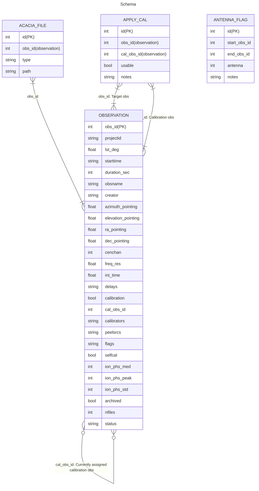

# Schema for the GPM processing database

## Overview diagram



## Tables

| Table | Type | Description |
| :---- | :--- | :---------- |
| `acacia_file`  | Base | The locations of data products that have been uploaded to Acacia |
| `antennaflag`  | Base | Tiles that have been flagged as unusable over a specified time period |
| `apply_cal`    | Base | Calibration solutions that can/can't be applied to specific observations |
| `assigned_cal` | View | Same as `apply_cal`, but shows the epoch instead of the id |
| `calapparent`  | Base | [Deprecated] |
| `epoch`        | View | For each observation, which "epoch" it belongs to. |
| `mosaic`       | Base | Generated mosaics (not currently used) |
| `observation`  | Base | The metadata for MWA observations |
| `processing`   | Base | Processing jobs run on the supercomputer |
| `sources`      | Base | Source models for calibration (currently not used) |

## View definitions

### `epoch`

This view defines what `epoch` even means.
It's a calculated number based on the number of days since a particular arbitrary time.

```
CREATE VIEW epoch AS
    SELECT observation.obs_id AS obs_id,
           CONCAT('Epoch',
                  LPAD(FLOOR(((observation.obs_id - 1335398418) / 86400)),4,'0')) AS epoch,
           FROM_UNIXTIME((observation.obs_id + 315964800)) AS approx_datetime
    FROM observation;
```

### `epoch_overview`

This view shows just the most recent tasks that users has processed.

```
CREATE VIEW epoch_overview AS
    WITH s1 AS
        (SELECT processing.job_id AS job_id,
                processing.obs_id AS obs_id,
                processing.user AS user,
                processing.task AS task,
                processing.cal_obs_id AS cal_obs_id,
                processing.submission_time AS submission_time,
                processing.status AS status,
                RANK() OVER
                    (PARTITION BY processing.obs_id,
                                  processing.user,
                                  processing.task
                         ORDER BY processing.submission_time desc) AS Rank FROM processing)
    SELECT s1.job_id AS job_id,
           s1.obs_id AS obs_id,
           epoch.epoch AS epoch,
           s1.user AS user,
           s1.task AS task,
           FROM_UNIXTIME(s1.submission_time) AS submission_time,
           s1.status AS status,
           s1.cal_obs_id AS cal_obs_id,
           ac.usable AS cal_usable,
           ac.notes AS cal_notes
        FROM s1
            LEFT JOIN epoch ON s1.obs_id = epoch.obs_id
            LEFT JOIN apply_cal ac ON (s1.obs_id = ac.obs_id) and (s1.cal_obs_id = ac.cal_obs_id)
        WHERE s1.Rank = 1;
```

### `overview_summary`

This view shows how many of the most recently added tasks (i.e. the tasks that are shown in [`epoch_overview`](#epoch-overview)) for each combination of `epoch` and `user`.

```
CREATE VIEW overview_summary AS
  SELECT epoch, count(*) AS completed, user, p.pipeline
    FROM epoch_overview AS eo
    LEFT JOIN pipeline_step AS p ON eo.task = p.task
    LEFT JOIN observation AS o ON eo.obs_id = o.obs_id
    WHERE eo.status = 'finished'
        AND o.calibration = false
    GROUP BY epoch, user, pipeline;
```

### `nobs_per_epoch`

This view shows how many non-calibration observations are in each epoch.

```
CREATE VIEW nobs_per_epoch AS
    SELECT e.epoch,
           count(*) AS nobs
        FROM observation AS o
        LEFT JOIN epoch AS e
            ON o.obs_id = e.obs_id
        WHERE o.calibration = false
        GROUP BY e.epoch;
```

### `epoch_completion`

This view is the same as [`overview_summary`](#overview-summary) but with an extra column showing the total number of pipeline steps to be completed for each epoch/user/pipeline step combination.

```
CREATE VIEW epoch_completion AS
    SELECT os.*, count(*) AS total
        FROM overview_summary AS os
        LEFT JOIN pipeline_step AS ps
            ON os.pipeline = ps.pipeline
        LEFT JOIN epoch AS e
            ON os.epoch = e.epoch
        LEFT JOIN observation AS o
            ON e.obs_id = o.obs_id
        WHERE o.calibration = false
        GROUP BY os.epoch, os.completed, os.user, os.pipeline;
```

### `backup`

This view computes the official paths (e.g. on Acacia) where the data are backed up.

```
CREATE VIEW backup AS
    SELECT obs_id,
           epoch,
           IF(approx_datetime < '2024-01-01',
              CONCAT("mwasci:gpmon/", LOWER(epoch), "/", obs_id, ".tar.gz"),
              CONCAT("mwasci:gpm2024/", epoch, "/", obs_id, ".tar.gz")
           ) AS acacia
    FROM epoch;
```
