# Calibration errors notes

## 16 August 2023

### 9:00am

Efforts (over the last few days) to get workable calibration solutions for the Epoch0130 observations have not been successful.
I tried mainly in-field calibration of the observations themselves, using a sky model which Natasha put together that includes Cyg A, which appears near the edge of the primary beam in many of these observations.
However, the calibration solutions were not good, and as of this writing, it remains unclear what the issue is. It may be that the Cyg A model is not accurate enough, or perhaps other bright sources in the field were interfering.

**1346656552 (calibrate)**
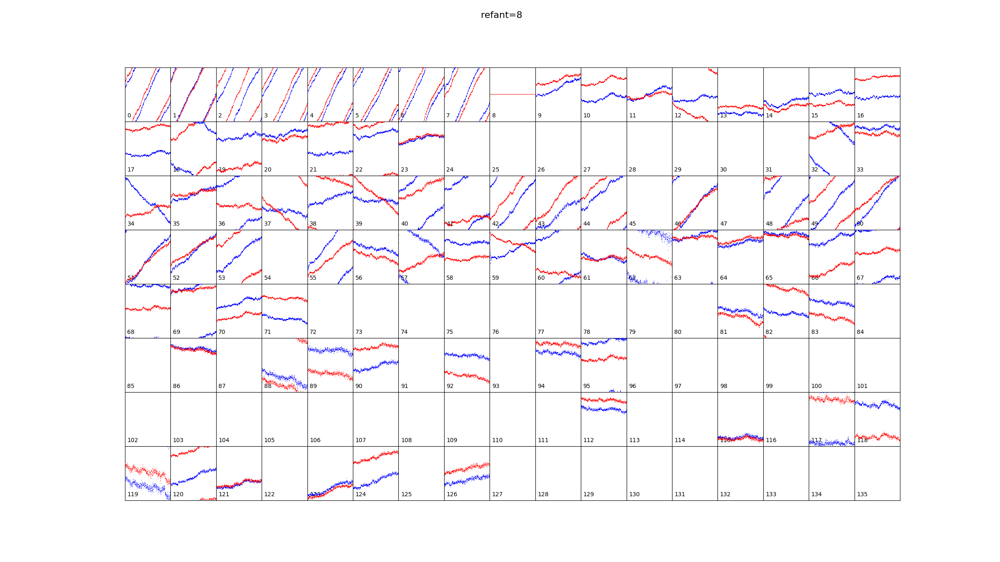

One possibility was that the bright sidelobe in the north was contributing too much flux, so I also tried constructing a model that included both sources in the main lobe as well as sources in that northern sidelobe.
However, it did not materially improve the solutions.
The current best guess is that the difficulty of obtaining a good calibration solution is related to the fact that so many tiles seems to be flagged.

I also tried with `hyperdrive`, but also without material improvement. The solutions do, however, look slightly different on the small scale:

**1346656552 (hyperdrive)**
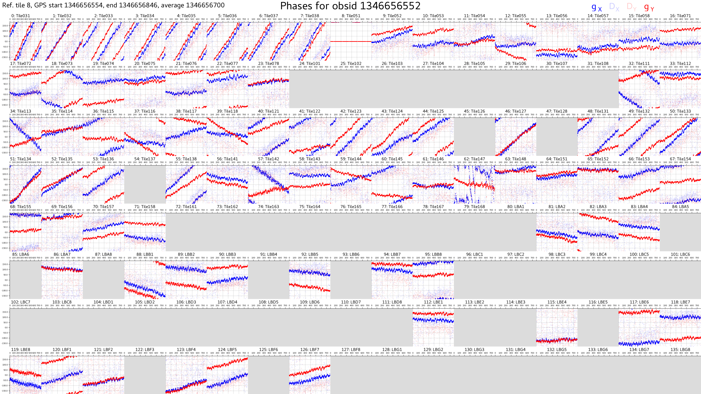

At this point, Natasha suggested that the fact that so many tiles had been flagged probably made it not worth the effort to try and salvage those data, and to turn our efforts to a different night, e.g., Epoch0123.
It's frustrating, though, because when the calibration solutions are transferred from later on that evening, the images look otherwise ok, except for the apparent smearing of the PSF ostensibly due to the cable lengths changing because they cool down when the sun sets (which was the reason for redoing this processing in the first place).
So if the data are good enough to make images with a slightly wrong solution, then I think it must be the sky model in that field that is making it so challenging to calibrate on.

Now I have turned my attention to Epoch0123.
The observations go from 1346046184 to 1346073496, with the originally-made calibration observation at 1346063456.
It turns out that there was also a calibration solution made before the observing run, at 1346045888.

| GPS second | Local date/time (AWST) | Description |
| ---------- | ---------------------- | ----------- |
| 1346045888 | 2022-09-01 13:37:50    | Calibration observation                 |
| 1346046184 | 2022-09-01 13:42:46    | First observation in Epoch0123          |
| 1346063456 | 2022-09-01 18:30:38    | Originally-used calibration observation |
| 1346073496 | 2022-09-01 21:17:58    | Last observation in Epoch0123           |

The differences between the calibration solutions of 1346045888 and 1346063456 are very telling:

**1346045888**:
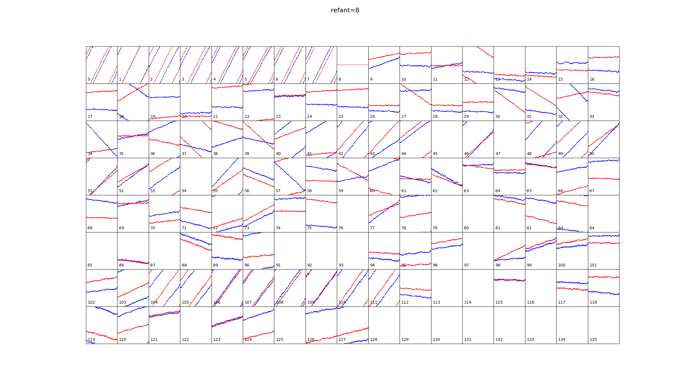

**1346063456**:
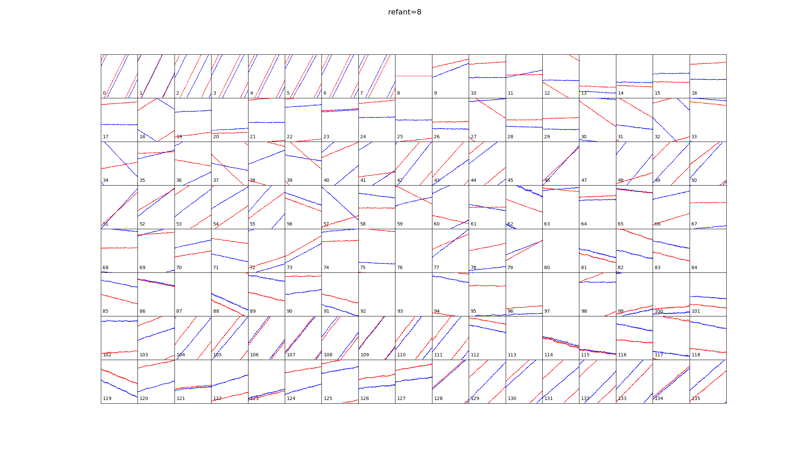

Apart from the slightly larger noise level throughout, it can be seen that many (most?) tiles do not change, but there are a few tiles whose phase slopes have been shifted significantly, consistent indeed with a slight change in cable length (e.g. due to temperature fluctuations.
This gives me even more confidence that it should be possible to converge on the better solution by only solving for the remaining cable length.

### 9:30am

I had forgotten that I had already looked at whether there was a dedicated calibration observation before the Epoch0130 run.
Turns out there was, and I had already generated a solution for it.
Here is what I had previously written about it.

Obsid **1346649040** is really close in time to the problem obs, was taken at the same frequency (ch 157), but is on calibrator **J121834-101851** (instead of HerA like 1346668464).

```
export epoch=Epoch0130
export obsid=1346649040
export datadir="${GXSCRATCH}"
export pdir="$datadir/$epoch"

mkdir -p $pdir
echo "${obsid}" > "${pdir}/calid2.txt"

dep=($(obs_manta.sh -p "${epoch}" -o "${pdir}/calid2.txt"))
depend=${dep[3]}
dep=($(obs_autoflag.sh -d ${depend} -p "${epoch}" "${obsid}"))
depend=${dep[3]}
obs_autocal.sh -d ${depend} -p "${epoch}" -f 0.5 "${obsid}"
```

Here are the solutions it generated (**1346649040**):
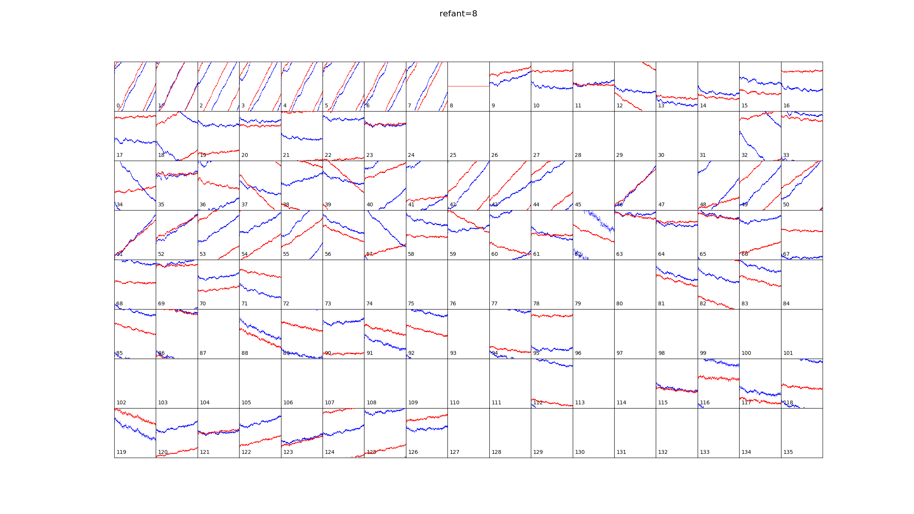

For comparison, here are the solutions taken after the sun had set (**1346668464**):
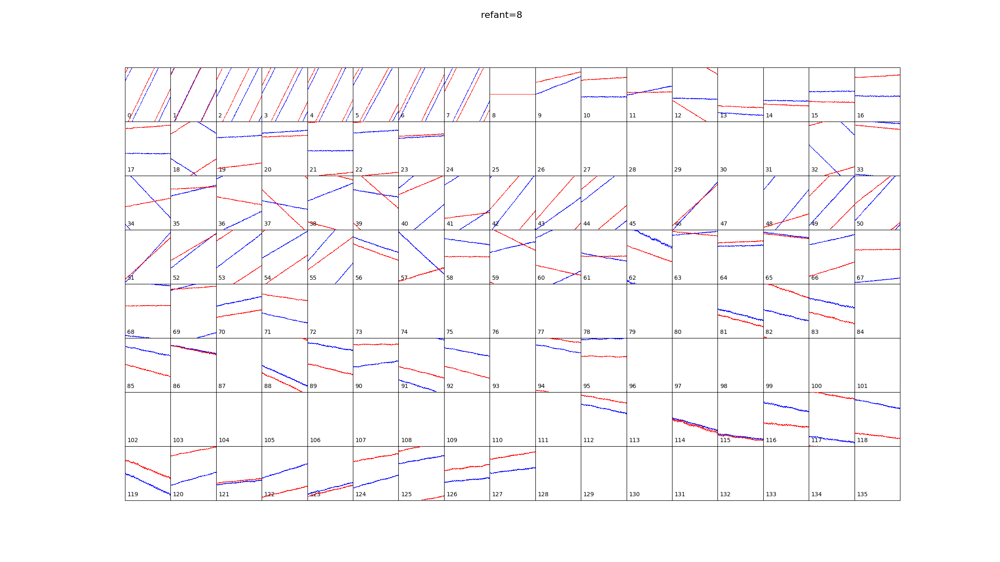

### 5:30pm

Natasha agrees that using the better solutions and changing just a single delay term for each tile (for Epoch0130) should do the trick, so now I'm working on a little script using `aocal.py` to do just that.
Essentially, it adds a constant phase to each tile in a good calibration solution to best match up with the phases of another, *less* good calibration solution.
The first working version (included after commit #2d65aba) is included in `scripts/sync_delays.py`.

In the container, and making sure of correct paths to the `.bin` files, run
```
transfer_delays.py 1346668464_local_gleam_model_solutions_initial.bin 1346649040_local_gleam_model_solutions_initial.bin 1346668464_shifted_to_1346649040_phase.png
```

The resulting phases are here:
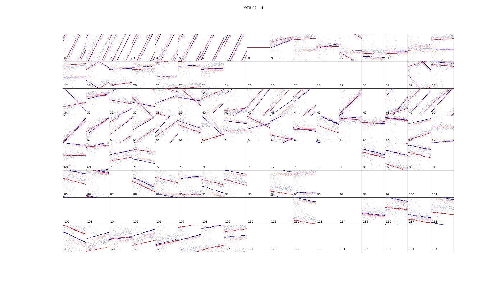

## 21 August 2023

### 10:45am

First up, make sure the observations are correctly assigned the correct calibrator obs in the GPM database.
It looks like the `observation` table already has a `cal_obs_id` column which is currently not being used at all.

It looks like Natasha originally used the following set of calibration observations for each Epoch:
```
garrawarla-2:/astro/mwasci/nhurleywalker> ls -d Epo* -1 | while read epoch; do echo "$epoch: cal_id = $(cat $epoch/calid.txt)"; done
Epoch0032: cal_id = 1338221864
Epoch0039: cal_id = 1338825016
Epoch0046: cal_id = 1339428160
Epoch0053: cal_id = 1340031312
Epoch0060: cal_id = 1340634464
Epoch0065: cal_id = 1341065280
Epoch0074: cal_id = 1341840640
Epoch0076: cal_id = 1342009784
Epoch0081: cal_id = 1342443784
Epoch0084: cal_id = 1342702280
Epoch0088: cal_id = 1343041216
Epoch0091: cal_id = 1343305480
Epoch0095: cal_id = 1343650144
Epoch0098: cal_id = 1343908576
Epoch0102: cal_id = 1344253232
Epoch0105: cal_id = 1344511728
Epoch0116: cal_id = 1345459528
Epoch0119: cal_id = 1345718024
Epoch0123: cal_id = 1346063456
Epoch0130: cal_id = 1346668464
Epoch0133: cal_id = 1346921976
cat: Epoch0137/calid.txt: No such file or directory
Epoch0137: cal_id = 
cat: Epoch0144/calid.txt: No such file or directory
Epoch0144: cal_id = 
```

But putting these into the database as is would not allow one to know which ones worked and which ones didn't work.
So I will add a new table so that this kind of information can be better tracked.
I will reserve the `cal_obs_id` column for the calibration observation that should be used.

```
mysql> create table apply_cal(id int auto_increment not null, obs_id int not null, cal_obs_id int not null, usable boolean, notes varchar(4096), primary key(id), foreign key(obs_id) references observation(obs_id), foreign key(cal_obs_id) references observation(obs_id));
```

I notice also that nowhere in the database is there any reference to the "Epoch" number that Natasha came up with to group each night's observations together.
That number is based on the script `determine_epoch.py` in the GPM repo, but it would be handy for database queries to have the Epoch number in the database too.
So, why not just add it?

```
mysql> create view epoch as select obs_id, concat("Epoch", lpad(floor((obs_id - 1335398418)/86400), 4, '0')) as epoch from observation;
```

Now I can put in the putative calibrator observations as follows:
```
mysql> ...
insert into apply_cal(obs_id, cal_obs_id) select obs_id, 1338221864 from epoch where epoch = "Epoch0032";
insert into apply_cal(obs_id, cal_obs_id) select obs_id, 1338825016 from epoch where epoch = "Epoch0039";
insert into apply_cal(obs_id, cal_obs_id) select obs_id, 1339428160 from epoch where epoch = "Epoch0046";
insert into apply_cal(obs_id, cal_obs_id) select obs_id, 1340031312 from epoch where epoch = "Epoch0053";
insert into apply_cal(obs_id, cal_obs_id) select obs_id, 1340634464 from epoch where epoch = "Epoch0060";
insert into apply_cal(obs_id, cal_obs_id) select obs_id, 1341065280 from epoch where epoch = "Epoch0065";
insert into apply_cal(obs_id, cal_obs_id) select obs_id, 1341840640 from epoch where epoch = "Epoch0074";
insert into apply_cal(obs_id, cal_obs_id) select obs_id, 1342009784 from epoch where epoch = "Epoch0076";
insert into apply_cal(obs_id, cal_obs_id) select obs_id, 1342443784 from epoch where epoch = "Epoch0081";
insert into apply_cal(obs_id, cal_obs_id) select obs_id, 1342702280 from epoch where epoch = "Epoch0084";
insert into apply_cal(obs_id, cal_obs_id) select obs_id, 1343041216 from epoch where epoch = "Epoch0088";
insert into apply_cal(obs_id, cal_obs_id) select obs_id, 1343305480 from epoch where epoch = "Epoch0091";
insert into apply_cal(obs_id, cal_obs_id) select obs_id, 1343650144 from epoch where epoch = "Epoch0095";
insert into apply_cal(obs_id, cal_obs_id) select obs_id, 1343908576 from epoch where epoch = "Epoch0098";
insert into apply_cal(obs_id, cal_obs_id) select obs_id, 1344253232 from epoch where epoch = "Epoch0102";
insert into apply_cal(obs_id, cal_obs_id) select obs_id, 1344511728 from epoch where epoch = "Epoch0105";
insert into apply_cal(obs_id, cal_obs_id) select obs_id, 1345459528 from epoch where epoch = "Epoch0116";
insert into apply_cal(obs_id, cal_obs_id) select obs_id, 1345718024 from epoch where epoch = "Epoch0119";
insert into apply_cal(obs_id, cal_obs_id) select obs_id, 1346063456 from epoch where epoch = "Epoch0123";
insert into apply_cal(obs_id, cal_obs_id) select obs_id, 1346668464 from epoch where epoch = "Epoch0130";
insert into apply_cal(obs_id, cal_obs_id) select obs_id, 1346921976 from epoch where epoch = "Epoch0133";
#insert into apply_cal(obs_id, cal_obs_id) select obs_id, ? from epoch where epoch = "Epoch0137";
#insert into apply_cal(obs_id, cal_obs_id) select obs_id, ? from epoch where epoch = "Epoch0144";
```

I'm not sure what the calibration observations for the last two were (they're not in Natasha's folders).
I'll have to find that out later.

Looks like the calibration observation 1343041216 isn't already in the `observation` table.
I'll have to put it in "manually":

```
[first load GPM profile]
cd $GPMBASE
singularity exec ${GXCONTAINER} ./gpm_track.py import_obs --obs_id 1343041216
```

I also need to start documenting how to use the pipeline.
This I'll start in the `doc` folder in the GPM repo.

### 1:30pm

Given the data I just put into the `apply_cal` table, I will now "initialise" the `cal_obs_id` column in the `observation` table to be the default calibration observations.

```
mysql> update observation o right join apply_cal a on o.obs_id = a.obs_id set o.cal_obs_id = a.cal_obs_id;
```

Added a unique constraint to `apply_cal`:

```
mysql> alter table apply_cal add constraint UC_calid_and_obsid unique(obs_id, cal_obs_id);
```

### 4:15pm

Looking now at the final mosaics to get a sense of which Epochs might need their calibration improved.
Follow the links in the table to see some example images.

| Epoch | Notes |
| ----- | ----- |
| Epoch0032 | Good |
| [Epoch0039](#epoch0039) | Observations **early** in the observing run show source smearing. |
| [Epoch0046](#epoch0046) | Source smearing, both **early** in the run and in the **middle**. Some elongation of sources near the **end**, too. |
| [Epoch0053](#epoch0053) | Observations **early** in the observing run show source smearing. |
| [Epoch0060](#epoch0060) | Observations **early** and **middle** in the observing run show source smearing. |
| [Epoch0065](#epoch0065) | Observations **early** and **middle** in the observing run show source smearing. |

#### Epoch0039

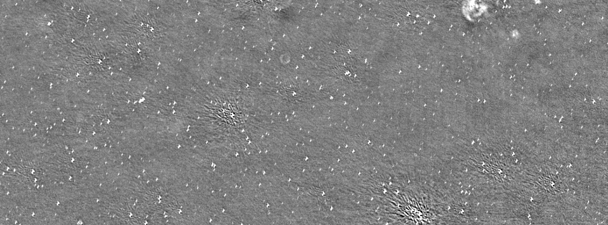

#### Epoch0046

Different kinds of artefacts throughout the observing run.
Showing examples from "early", "middle", and "late" during the run.

##### Early

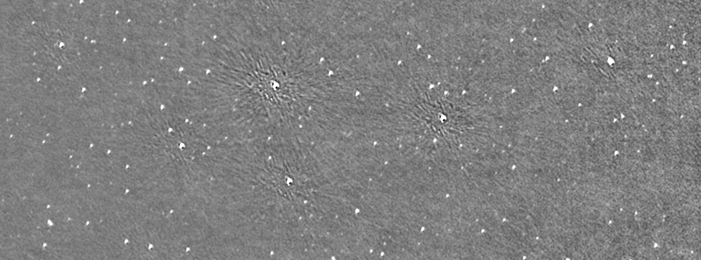

##### Middle

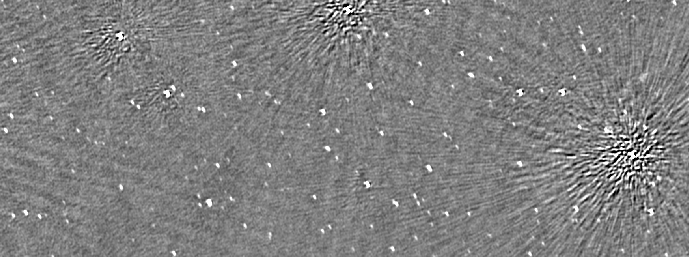

##### Late

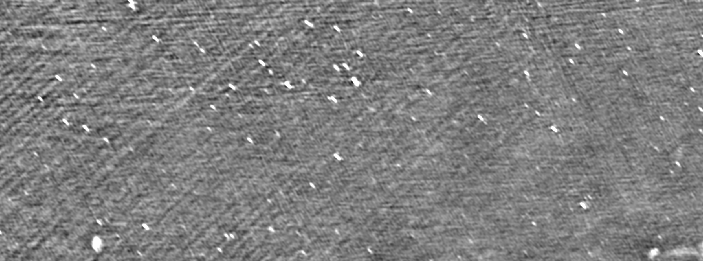

#### Epoch0053

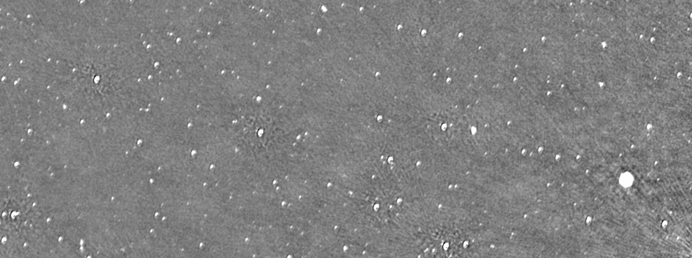

#### Epoch0060

##### Early

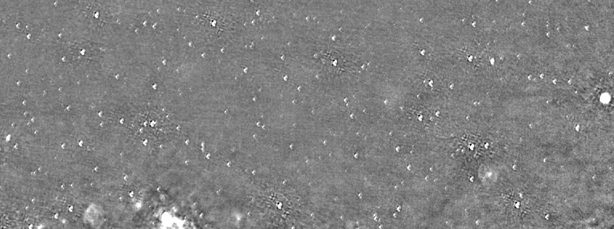

##### Middle

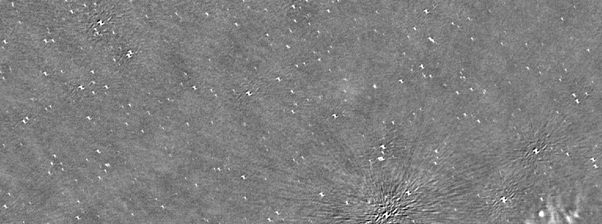

#### Epoch0065

##### Early

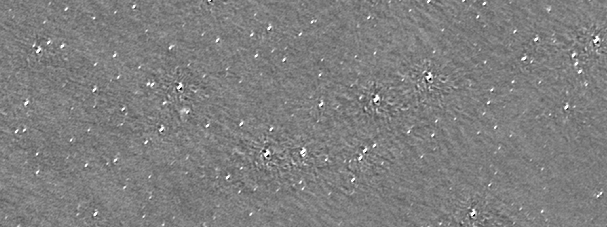

##### Middle

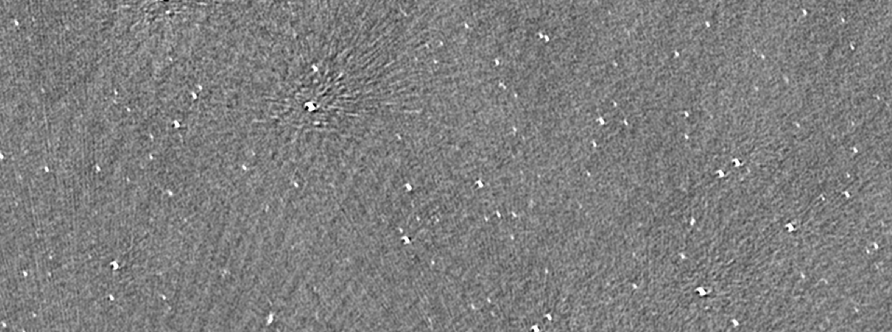


